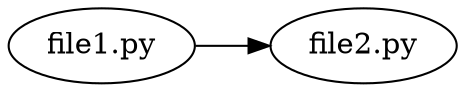

# Dependency Graph Analyzer

A Python automation script that analyzes file relationships by examining references, imports, or dependencies found in file contents, generating a dependency graph. Useful for understanding code structure, identifying dependencies, and visualizing file relationships.

## Features

- **Multi-language support**: Analyzes Python, JavaScript, TypeScript, Java, and C/C++ files
- **Import extraction**: Identifies imports and dependencies from file contents
- **Dependency graph generation**: Builds a graph of file relationships
- **Reverse dependency analysis**: Finds what files depend on each file
- **Multiple output formats**: Text, JSON, and Graphviz DOT format
- **Recursive scanning**: Optionally scan directories recursively
- **External dependency handling**: Optionally include or exclude external dependencies
- **Comprehensive reporting**: Detailed statistics and dependency information

## Prerequisites

- Python 3.8 or higher
- pip (Python package installer)

## Installation

### Step 1: Navigate to Project Directory

```bash
cd dependency-graph-analyzer
```

### Step 2: Create Virtual Environment

```bash
python3 -m venv venv
source venv/bin/activate  # On Windows: venv\Scripts\activate
```

### Step 3: Install Dependencies

```bash
pip install -r requirements.txt
```

## Configuration

### Configuration File (config.yaml)

The script supports configuration via a YAML file:

```yaml
base_path: "./src"
recursive: true
follow_external: false
max_depth: null
```

## Usage

### Basic Usage

Analyze files in a directory:

```bash
python src/main.py /path/to/code
```

### Recursive Scanning

Recursively scan directories:

```bash
python src/main.py /path/to/code --recursive
```

### Specify Base Path

Set base path for resolving imports:

```bash
python src/main.py /path/to/code --base-path /path/to/project
```

### Include External Dependencies

Include external dependencies in the graph:

```bash
python src/main.py /path/to/code --follow-external
```

### Output to Text File

Save text report to file:

```bash
python src/main.py /path/to/code --output report.txt
```

### Export to JSON

Export dependency graph as JSON:

```bash
python src/main.py /path/to/code --json graph.json
```

### Export to Graphviz DOT

Export for visualization with Graphviz:

```bash
python src/main.py /path/to/code --dot graph.dot
```

### Use Configuration File

```bash
python src/main.py /path/to/code --config config.yaml
```

### Command-Line Arguments

- `paths`: File paths or directory paths to analyze (required, one or more)
- `--base-path`: Base path for resolving relative imports
- `--recursive`: Recursively scan directories
- `--follow-external`: Include external dependencies in graph
- `--max-depth`: Maximum depth for dependency traversal
- `--output`: Output file path for text report
- `--json`: Output JSON file path
- `--dot`: Output Graphviz DOT file path
- `--config`: Path to configuration file (YAML)

## Project Structure

```
dependency-graph-analyzer/
├── README.md                 # This file
├── requirements.txt          # Python dependencies
├── config.yaml              # Configuration file template
├── .gitignore               # Git ignore rules
├── src/
│   ├── __init__.py
│   └── main.py              # Main script implementation
├── tests/
│   ├── __init__.py
│   └── test_main.py         # Unit tests
├── docs/
│   └── API.md               # API documentation (if applicable)
└── logs/
    └── .gitkeep             # Log directory placeholder
```

### File Descriptions

- `src/main.py`: Core implementation with DependencyGraphAnalyzer class and CLI interface
- `config.yaml`: Default configuration file with analysis settings
- `tests/test_main.py`: Unit tests for all public functions
- `logs/`: Directory for log files (created automatically)

## Supported File Types

The script analyzes dependencies in:

- **Python**: `.py` files (import statements)
- **JavaScript**: `.js`, `.jsx` files (import/require statements)
- **TypeScript**: `.ts`, `.tsx` files (import statements)
- **Java**: `.java` files (import statements)
- **C/C++**: `.c`, `.cpp`, `.h`, `.hpp` files (include statements)

## Output Formats

### Text Format

Human-readable text report:

```
Dependency Graph Analysis
================================================================================

Files processed: 10
Dependencies found: 25
  - Internal: 20
  - External: 5
Errors: 0

--------------------------------------------------------------------------------

Dependency Graph:

/path/to/file1.py
  -> /path/to/file2.py
  -> /path/to/file3.py

/path/to/file2.py
  (no dependencies)
```

### JSON Format

Structured JSON for programmatic processing:

```json
{
  "stats": {
    "files_processed": 10,
    "dependencies_found": 25
  },
  "graph": {
    "/path/to/file1.py": ["/path/to/file2.py", "/path/to/file3.py"]
  },
  "reverse_graph": {
    "/path/to/file2.py": ["/path/to/file1.py"]
  }
}
```

### Graphviz DOT Format

For visualization with Graphviz tools:



To visualize DOT files:

```bash
dot -Tpng graph.dot -o graph.png
dot -Tsvg graph.dot -o graph.svg
```

## Import Patterns Detected

### Python

- `import module`
- `from module import ...`
- `import package.module`

### JavaScript/TypeScript

- `import ... from 'module'`
- `require('module')`
- `import 'module'`

## Testing

### Run Tests

```bash
pytest tests/
```

### Run Tests with Coverage

```bash
pytest tests/ --cov=src --cov-report=html
```

### Test Coverage

The test suite aims for minimum 80% code coverage and includes:
- Import extraction from different file types
- Module resolution
- Dependency graph building
- Reverse dependency analysis
- Output formatting
- Error handling

## Troubleshooting

### Common Issues

**Issue: "No dependencies found"**

Solution: Verify that:
- Files contain import statements
- File types are supported
- Base path is set correctly for relative imports
- Files are accessible and readable

**Issue: "Could not resolve module"**

Solution: Check that:
- Base path is set correctly
- Module files exist in expected locations
- Import paths match file structure

**Issue: "Permission denied"**

Solution: Ensure you have read permissions for the files you're trying to analyze.

**Issue: "Encoding error"**

Solution: The script tries UTF-8 first, then falls back to latin-1. If issues persist, check file encoding.

### Error Messages

All errors are logged to both the console and `logs/analyzer.log`. Check the log file for detailed error information and stack traces.

### Log Files

Log files are stored in the `logs/` directory:
- `analyzer.log`: Main log file with all operations and errors

## Visualizing Dependency Graphs

### Using Graphviz

1. Install Graphviz: `brew install graphviz` (macOS) or `apt-get install graphviz` (Linux)
2. Generate DOT file: `python src/main.py /path/to/code --dot graph.dot`
3. Create visualization: `dot -Tpng graph.dot -o graph.png`

### Using Online Tools

Upload the DOT file to online Graphviz viewers like:
- [Graphviz Online](https://dreampuf.github.io/GraphvizOnline/)
- [WebGraphviz](http://www.webgraphviz.com/)

## Performance Considerations

- Processing large codebases may take time
- Recursive scanning of large directory trees may be slow
- Module resolution requires file system access
- Graph building is efficient for typical project sizes

## Best Practices

1. **Set base path**: Use `--base-path` to correctly resolve relative imports
2. **Use recursive scanning**: Enable `--recursive` for complete analysis
3. **Export to JSON**: Use JSON format for programmatic processing
4. **Visualize graphs**: Use DOT format with Graphviz for visual understanding
5. **Filter external dependencies**: Use `--follow-external` selectively

## Limitations

- **Dynamic imports**: Cannot detect dynamically constructed import paths
- **Complex module resolution**: May not handle all module resolution scenarios
- **Language-specific features**: Some language-specific import features may not be detected
- **Circular dependencies**: Circular dependencies are shown but not validated

## Contributing

### Development Setup

1. Fork the repository
2. Create a feature branch: `git checkout -b feature/your-feature-name`
3. Make your changes following the code style guidelines
4. Write or update tests
5. Ensure all tests pass: `pytest tests/`
6. Commit your changes with conventional commit messages
7. Push to your branch and create a pull request

### Code Style Guidelines

- Follow PEP 8 strictly
- Maximum line length: 88 characters
- Use type hints for all function parameters and return values
- Write docstrings for all public functions and classes
- Use meaningful variable and function names
- Keep functions focused on a single responsibility

### Pull Request Process

1. Ensure all tests pass
2. Update documentation if needed
3. Follow conventional commit message format
4. Request review from maintainers

## License

This project is provided as-is for educational and automation purposes.
